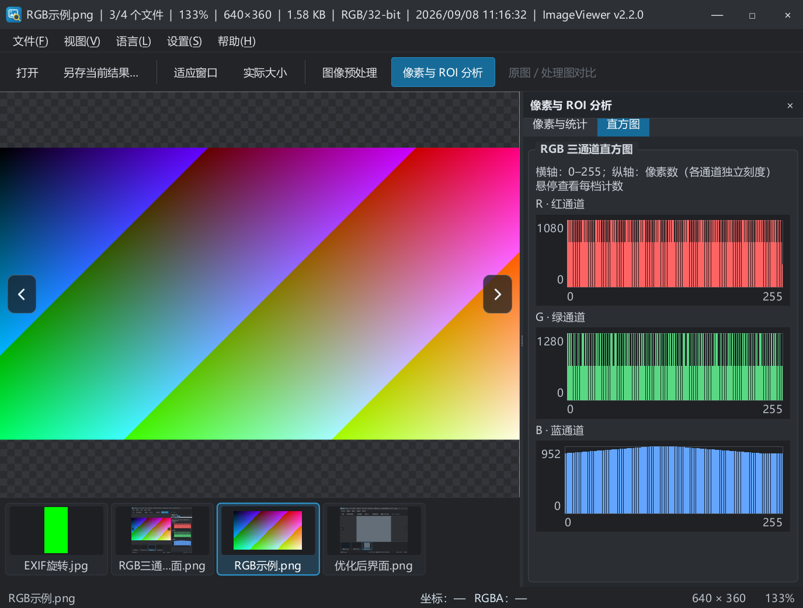

# ImageViewer

面向日常看图与工业视觉调试的 Windows 桌面图像查看器。打开本地图片，快速缩放、翻图、查看像素值，并通过 OpenCV 预处理与 ROI 分析观察图像。

[](https://github.com/BlazarLin/ImageViewer/actions/workflows/windows.yml)
[](LICENSE)

**当前源码版本：2.2.0。** 项目正在准备首次开源发布；公开便携包以 [GitHub Releases](https://github.com/BlazarLin/ImageViewer/releases) 中实际上传的资产为准。CI 产物是待验收构建，不等同于正式版本。



## 功能

- PNG、JPEG、BMP、TIFF、WebP、GIF 等常见图片；支持中文路径、拖放和命令行打开。
- 光标锚定缩放、适应窗口/宽度/高度、100% 原尺寸模式、双击切换适配与 100%；高倍率像素网格。
- 当前目录自然排序、异步缩略图、图像两侧翻图箭头、左右方向键；F5 刷新目录。
- 深色圆角窗口，默认 18px 界面字体，跟随 Windows 高 DPI 缩放；状态栏实时显示零起点坐标与 RGBA 值，右键可打开所在文件夹。
- 亮度、对比度、Gamma、灰度与通道查看；平滑、锐化、阈值、边缘和形态学预处理。
- 原图/处理图分割对比、结果另存、JSON 参数预设；隐藏面板不会撤销已经启用的处理。
- ROI 通道最小值、最大值、均值、标准差；彩色图显示 R/G/B 三通道直方图，灰度图显示单通道。图表包含刻度，可悬停查看每档计数。
- 前台异步解码与过期请求丢弃、邻图预加载、受限解码与缩略图缓存、大图显示金字塔。
- 简体中文与 English；语言切换后重启生效。

## 快速使用

解压完整便携包后运行 `ImageViewer.exe`。请保留同目录 DLL、`platforms`、`imageformats` 和 `translations`；只复制 EXE 无法运行。

1. 点击“打开”或将图片拖入主图区。首次打开后，下方展示同目录缩略图。
2. 滚轮缩放、左键拖动平移；点击图像两侧箭头或按左右方向键翻图。
3. 鼠标移到图像上查看状态栏像素值。`Ctrl+I` 打开分析面板，`Shift + 左键拖动` 选择 ROI；切换面板内“直方图”页查看通道分布。
4. `Ctrl+P` 打开预处理面板并启用实时预处理。`Ctrl+Shift+S` 将当前结果另存为新文件。

图像处理与统计使用当前显示的 8 位数据。RGB 图即使选到纯灰区域也保留三个通道；三个图表分别标明各自的像素数刻度。ROI 为所选矩形区域，分割对比时统计完整处理图；悬停取样按分割线所在一侧读取图像。

## 环境与依赖

| 项目 | 说明 |
| --- | --- |
| 平台 | Windows 10/11 x64 |
| 语言 | C++17 |
| 本地已验证 | VS2019 v142、Qt 5.14.2 MSVC2017 x64、OpenCV 4.5.5 |
| CI 配置 | Windows 2022 runner、VS2022、Qt 5.15.2 MSVC2019 x64、OpenCV 4.5.5 源码构建 |
| CMake | 3.20 或更新版本 |

Qt 需要 Core、Gui、Widgets、Concurrent、Svg、LinguistTools 及图片格式插件；OpenCV 需要共享 `opencv_world` 库。**不需要 Qt VS Tools 插件。** Qt/OpenCV 旧版本用于兼容已有环境，公开发布前应评估升级，见 [安全说明](SECURITY.md)。

### 配置依赖

在 PowerShell 中为当前会话设置安装路径（下面仅为示例）：

```powershell
$env:QTDIR = 'C:/SDK/Qt/5.14.2/msvc2017_64'
$env:OPENCV_DIR = 'C:/SDK/opencv/build'
```

VS 工程支持两种 OpenCV 4.5.5 布局：`include/lib/bin` 平铺结构，或官方 Windows 包的 `include` 与 `x64/vc15/lib、bin`。必须同时有 Release/Debug 导入库和运行时 DLL。仓库历史上保留的 `3rdpart/opencv` 头文件与导入库**不是完整 SDK**，不包含运行时。

也可使用忽略的 `cmake/Config.local.props` 设置机器级默认值；请给每个默认属性添加 `Condition="'$(QTDIR)' == ''"` 等条件，让环境变量优先。不要修改并提交公共配置中的机器路径。

### VS2019 构建与测试

```powershell
.\scripts\build.ps1 -Cfg Debug
.\bin\Tests\Debug\ImageViewerCoreTests.exe
.\scripts\build.ps1 -Cfg Release
.\bin\Tests\Release\ImageViewerCoreTests.exe
.\scripts\check-bom.ps1
```

或打开 `ImageViewer.sln`，选择 `Debug | x64`，将 ImageViewer 设为启动项目后按 F5。构建脚本自动发现 VS2019，部署 Qt/OpenCV DLL 和图片插件。

### CMake 构建与测试

```powershell
cmake -S . -B build -G 'Visual Studio 16 2019' -A x64 "-DCMAKE_PREFIX_PATH=$env:QTDIR"
cmake --build build --config Debug
ctest --test-dir build -C Debug --output-on-failure
cmake --build build --config Release
ctest --test-dir build -C Release --output-on-failure
```

CMake 会读取 `OPENCV_DIR` 环境变量。使用独立 OpenCV CMake 安装/构建目录时，额外传入 `-DOpenCV_DIR=包含OpenCVConfig.cmake的目录`，该显式配置优先于仓库内依赖。VS2022 可将生成器改为 `Visual Studio 17 2022`；已有构建目录更换生成器时请使用新目录。

### 生成便携包

```powershell
.\scripts\package-release.ps1 -BinaryDir bin/Release -QtDir $env:QTDIR
# CMake 输出则使用 -BinaryDir build/Release
```

脚本创建独立运行目录、ZIP、SHA-256 校验文件与 `build-info.json`，只从当前 Release EXE 部署实际 Qt 依赖，不混入 Debug DLL。也可通过 `-DependencySourceDir` 附带依赖源码目录中的许可证和归属文件。维护者发布流程、源码和依赖许可检查见 [RELEASING](docs/RELEASING.md)。

## 快捷键

| 操作 | 快捷键 |
| --- | --- |
| 打开图片 | Ctrl+O |
| 上一张 / 下一张 | ← / → |
| 刷新当前目录 | F5 |
| 适应窗口 / 实际大小 | Ctrl+0 / Ctrl+1 |
| 切换适配与 100% | 双击图像 |
| 显示/隐藏预处理 | Ctrl+P |
| 显示/隐藏分析面板 | Ctrl+I |
| 选择 / 清除 ROI | Shift+左键拖动 / Esc |
| 原图/处理图分割对比 | Ctrl+D |
| 另存当前结果 | Ctrl+Shift+S |

## 项目结构

```text
src/app/           主窗口、启动与版本信息
src/ui/            图像视图、缩略图、预处理与分析控件
src/core/          解码、目录导航、图像处理、分析与缓存
src/util/          平台辅助功能
resources/         EXE 多尺寸图标资源
translations/      Qt 中英文翻译
tests/            独立行为回归程序
scripts/           构建、图标生成、编码检查和打包
.github/           CI、依赖更新、Issue/PR 模板
licenses/          第三方许可文本与归属说明
docs/             开发记录、截图和发布说明
```

## 验证与已知限制

回归程序返回非零即失败，当前 33 项检查覆盖解码、导航失败恢复、拖放事件、处理状态、ROI、RGB 直方图、缓存失效、异步请求、坐标取样、两侧箭头及圆角状态。UI 自动回归使用 offscreen；实际桌面高 DPI、拖放和多显示器仍需人工验收。

- GIF、动画 WebP、多页 TIFF 当前只显示解码器返回的首帧/页。
- 尚未提供 10/12/16 位原始精度取样、窗宽窗位或编码器级瓦片解码。
- 大图解码峰值内存取决于原始图像；金字塔仅优化解码后的显示。
- 单实例尚未转发第二实例文件参数；已有窗口运行时请从窗口内打开或拖入图片。
- 损坏图片会在状态栏提示并保留原图/索引，不自动跳过。
- 没有安装程序、代码签名或自动更新；目前仅准备 Windows x64 便携包。

## 开源与反馈

自有代码与文档采用 [MIT License](LICENSE)。Qt、OpenCV 及仓库内第三方内容保持原有许可，不因根目录 MIT 而重新授权。参见 [THIRD_PARTY_NOTICES](THIRD_PARTY_NOTICES.md)。

欢迎通过 [Issues](https://github.com/BlazarLin/ImageViewer/issues) 反馈问题或提出建议；提交代码前阅读 [贡献指南](CONTRIBUTING.md)。版本变化见 [CHANGELOG](CHANGELOG.md)，安全问题见 [SECURITY](SECURITY.md)。
