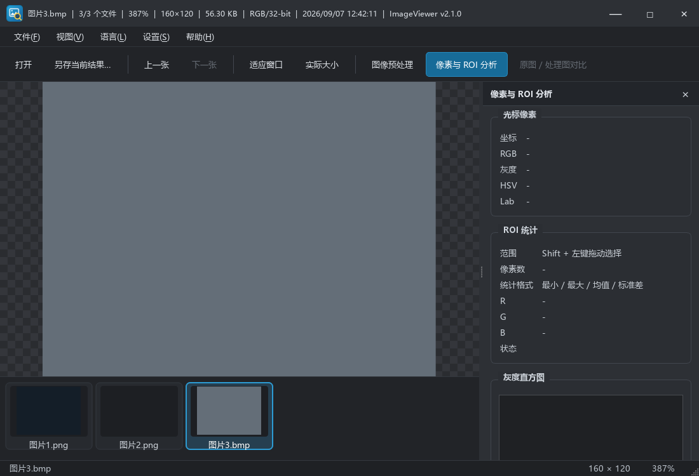

# ImageViewer 产品优化与验收记录

日期：2026-09-07。起点：`70a10cf`，承接《260907ImageViewer换机开发交接》。本轮按日常“打开 → 浏览 → 处理 → 分析 → 保存”流程落实以下 10 项优化。

## 10 个问题及落地结果

| 编号 | 优先级 | 原问题与用户影响 | 已实现行为 | 验证 |
| --- | --- | --- | --- | --- |
| 1 | P1 | 未命中缓存的主图在 UI 线程解码，大图打开期间窗口无响应 | 后台解码；单个活动任务，只保留最后请求；状态栏显示加载状态；解码异常转为错误结果 | TEST-12、15 |
| 2 | P1 | 上/下一张先移动索引再解码，损坏图片导致标题、选中项和当前图不一致 | 加载成功才提交导航位置；失败保留当前图和缩略图选中项，用状态栏提示；可继续点击其他缩略图 | TEST-16 |
| 3 | P1 | 开启预处理切图时旧画面可能滞留，参数变更后还能导出旧结果 | 新图成功解码后先展示新原图；等待/处理中禁用导出和对比；失败退回原图并说明原因；导出固定当前图像快照 | TEST-15、17、18 |
| 4 | P1 | 打开分析面板会隐藏预处理面板并关闭算法，无法分析刚刚处理的结果 | 两面板仍互斥显示，但显隐与算法开关解耦；关闭处理仅由启用开关/重置执行 | TEST-17；见待回复事项 Q1 |
| 5 | P1 | ROI 松手后边框消失；恢复原图后旧统计可能回写；新选区可能展示旧统计 | 松手保留选框；使用松手位置确定范围；新选区/切图/恢复原图/更新结果时使旧统计失效；Esc 清除；选区自动打开分析面板；离开视图清空像素读数 | TEST-14、18 |
| 6 | P2 | 双击进入 100% 后再次双击仍停在 100% | 双击按视图模式在适配与实际大小之间切换；添加操作提示，空图禁用缩放按钮 | TEST-13；桌面确认 76% → 100% → 76% |
| 7 | P1 | 无后缀保存可能失败，直接写目标文件可能破坏原文件 | 无后缀按所选格式补齐；补齐后的目标若已存在则确认覆盖；按扩展名编码，通过 QSaveFile 原子替换；错误保留旧文件；导出成功刷新目录 | TEST-11；系统保存对话框完整矩阵待手工复测 |
| 8 | P2 | 主图自动读取 EXIF 方向，但缩略图不旋转，照片方向不一致 | 缩略图应用 EXIF 方向；旋转时调整解码缩放尺寸；缓存键加入版本标记使旧方向缓存失效 | TEST-22，自动生成 Orientation=6 JPEG |
| 9 | P2 | 同目录缓存不重新扫描，新增/删除文件不可见 | 新增 F5“刷新图像和目录”；清理解码缓存并刷新缩略图；当前文件已删除时选择邻近剩余文件；内容可解码但后缀未知的当前图也进入导航 | TEST-10、23 |
| 10 | P2 | 每次启动重置窗口，打开文件对话框不记忆目录 | QSettings 保存/恢复窗口几何和面板布局；成功打开后记录目录；不自动重新启用上次算法 | TEST-21 |

## 换机部署补全

发现初始构建虽然返回 0，但仓库忽略的 OpenCV DLL 未随换机迁移，Qt platforms/imageformats 也未部署，无法获得可用主窗口。已从本机既有 OpenCV 4.5.5 安装补齐被忽略的运行库，未将 DLL 或个人依赖路径提交。

- VS 主程序与测试目标均部署 Qt 平台插件、图片插件和必需 OpenCV DLL；缺少必需依赖时明确报错。
- `scripts/build.ps1` 通过 vswhere 查找 VS2019，去除失效的个人 MSVC/SDK 头文件和库路径设置。
- CMake 同步编译窗口回归用例、部署插件，测试目标明确使用控制台子系统。
- CMake 的本地平铺 OpenCV 根目录优先读取 `OPENCV_DIR` 环境变量。
- 英文翻译 129 条完成、0 条未完成；本轮不变更版本号。

## 自动验证

测试仍为 `ImageViewerCoreTests.exe`，新增窗口交互用例，使用 Qt offscreen 平台运行，不抢占桌面。设置写入临时 INI 目录，与真实产品设置隔离；缓存使用 Qt 测试位置。23 个 TEST 检查包括原有 9 个核心用例。

最终构建和测试已在提交前复核；详细运行日志保留于本地 `obj/debug-build.log`、`obj/release-build.log`、`obj/cmake-build.log`、`obj/debug-tests.log`、`obj/release-tests.log`，不纳入 Git。

| 验证项 | 状态 |
| --- | --- |
| VS2019 x64 Debug 构建与 23 项测试 | 通过，退出码 0 |
| VS2019 x64 Release 构建与 23 项测试 | 通过，退出码 0 |
| CMake Release 构建与 CTest | 通过，1/1 测试执行器通过（内含 23 项检查） |
| 源码 UTF-8、BOM 检查与 git diff --check | 通过；源文件严格 UTF-8 解码成功 |
| Debug / Release EXE 与应用 PDB | 已生成 |

## 桌面验收与边界

- 已实际启动 Debug 和 Release 主窗口，确认中文首屏、空图按钮禁用。
- 已在 Debug 系统打开对话框输入中文本地路径，主图、文件名和缩略图正常显示。
- 已实际双击确认适配 → 100% → 适配。
- 自动用例 TEST-19 验证真实 ImageView viewport 接收 Qt 本地文件拖放事件，经 MainWindow 更新图片和同目录缩略图。它不是资源管理器真实跨窗口拖放；后者仍须人工复测，不以编译或自动事件通过冒充。
- 高倍率像素格、调试终端开关/复启、不同缩放比例/多屏布局、各种系统保存对话框后缀与覆盖组合仍需人工完整验收。
- `qtmain.lib` 第三方 PDB 缺失警告仍存在，应用自身 PDB 正常。Qt QVector 内部 C4127 警告仍存在。

## 后续边界

目录扫描和最终 QPixmap 创建仍在 UI 线程；不是超大图按瓦片解码。原有邻图预加载和金字塔任务仍会在关闭时等待结束。GIF/多页 TIFF 当前只展示读取到的首帧/首页。既有单实例逻辑未转发第二次启动传入的路径。这些范围问题见《260907产品待回复事项》，不宣称本轮全部解决。

## 界面记录

下图由同一窗口回归测试通过 QWidget::grab 生成，字体加载自本机 Windows 字体目录，用于布局核对，不代表资源管理器拖放已验收。

