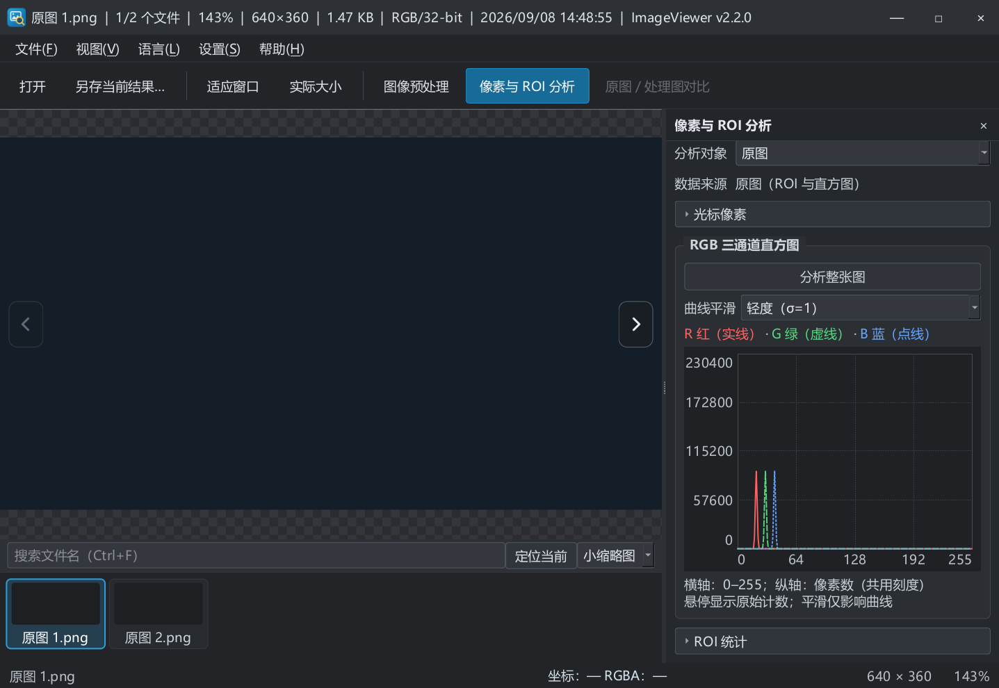

# 2026-09-08 集中反馈执行与验收

依据 [深度体验文档中的用户回复](260908深度体验与优化建议.md)，本轮完成 S01、S02、S03、S04、S05、S06、S09；跳过标记 P9 的 S07、S08、S10。版本沿用 2.2.0 未发布，未推送远端。

## 已实现行为

| 编号 | 本轮结果 | 验证 |
| --- | --- | --- |
| S01 | 修改参数保留对比开关和分割比例；等待/处理状态继续提示，完成后在原位置展示新结果 | TEST-41：拖动分割位置后修改亮度，完成后比例与开关不变 |
| S02 | 每次启动默认隐藏分析；面板可见且点击整图或选择 ROI 才启动。换图、处理完成、再次显示均不自动重算。隐藏作废排队任务并按行取消在途计算 | TEST-40、46、49；桌面检查空面板、手动整图与换图清空 |
| S03 | 分析对象支持当前结果/原图，每次只算一份；标明 ROI/直方图来源，光标来源跟随对比左右侧。建议保存名以 `_original` / `_processed` 区分 | TEST-42；实际保存对话框显示 `_processed.png` |
| S04 | 同用户会话通过本地管道转发，现有窗口恢复并激活；收到确认后第二实例退出，失败显示提示。多文件按顺序组成浏览列表 | TEST-47 使用真实子进程转发中文、空格、多文件、重复路径与无参数请求；TEST-48 验证跨目录浏览和删除刷新；桌面接收两个样图，第二进程退出码 0 |
| S05 | 亮度、对比度、Gamma、锐化使用可键入输入框，与滑块双向同步；右侧复原图标只重置该参数 | TEST-43 验证同步、单项复原和范围限制；桌面输入亮度 27，滑块同步 |
| S06 | 光标像素和 ROI 统计独立折叠并记住状态；释放的高度交给直方图，保留大字体 | TEST-44；桌面折叠两组，曲线区域实际扩大 |
| S09 | Ctrl+T 显隐缩略图，Ctrl+F 搜索名称；三档大小并保存偏好；定位当前清空过滤并滚到当前图。隐藏时不启动新的缩略图任务，左右键仍翻图 | TEST-45 覆盖中文空格、无匹配、定位、尺寸和隐藏导航；桌面隐藏后右方向键切到第二张 |

## 实测追加修正

- 新搜索框曾在启动时取得焦点，方向键留在输入框。本轮修正为成功打开图像后聚焦图像区；搜索框 Esc 清空过滤并返回图像区。
- 搜索匹配数跟随列表更新，目录刷新后不会残留旧计数。
- 分析常见 RGB888/RGB32/ARGB32 格式直接遍历图像数据，避免为小 ROI 转换整张大图；其他格式只转换 ROI 的一行。每行检查取消，不返回部分统计。
- 普通图像取样继续读取当前图像，保持分析隐藏时的实时状态栏读数。

## 验证与交付

- VS2019 Debug：构建成功，`QT_SCALE_FACTOR=1.5` 下 49 项检查全部通过。
- VS2019 Release：构建成功，49 项检查全部通过。
- CMake Release：构建成功，CTest 1/1 通过，执行同一组 49 项检查。
- 英文翻译 169 条有效消息，0 条未完成。运行编码检查和 `git diff --check`，保留源码原有 UTF-8 编码习惯。
- 既有 Qt 头文件常量表达式及 qtmain.pdb 警告仍存在，无编译错误。
- Release 桌面复测涵盖默认分析显隐、手动整图、折叠、双文件转发、隐藏缩略图翻图、数值输入、保存建议名称。对比比例、单来源 ROI、取消与复杂边界主要由自动回归验证，不计作完整桌面人工覆盖。
- 本轮未执行多显示器、干净系统部署、超大图长时间压力、全部处理算子组合测试，未进行公开发布。
- 日志位于忽略目录 `obj/260908-feedback-*-build.log`、`obj/260908-feedback-*-tests.log`；临时样图也仅保留本地。
- EXE：`bin/Release/ImageViewer.exe`；便携包：`dist/ImageViewer-2.2.0-windows-x64.zip`，附同名 SHA-256 文件。Qt Network 已加入 VS/CMake 部署及打包必需文件检查。

下图来自 Release 的 offscreen 回归，使用合成图片，展示折叠、来源和缩略图工具栏。

## 本地产品约定，后续可统一回复

本轮无阻塞疑问，以下按查看器定位采用默认约定：

1. 多文件参数按传入顺序建立临时浏览列表，显示第一张；单文件重新打开回到目录模式。第一张解码失败时提示错误并保留当前图，不在后台批量试解码其他文件。
2. 搜索只过滤缩略图显示，方向键仍浏览全部目录/批次文件；点击“定位当前”清除过滤。关键词不跨目录保存。
3. 隐藏分析会清空已完成数据，重新显示需手动分析。折叠状态与缩略图显隐、大小会保存，分析对象每次启动默认当前结果。
4. 分析选择“原图”只改变统计来源，不改变预处理、对比和保存对象；保存始终输出完整当前结果，不输出对比分割截图。

如需调整以上约定，可直接在本段回复。原有开源发布决策继续保留在 [Q10](260907产品待回复事项.md)，本轮未扩大发布范围。

**你的回复：**
