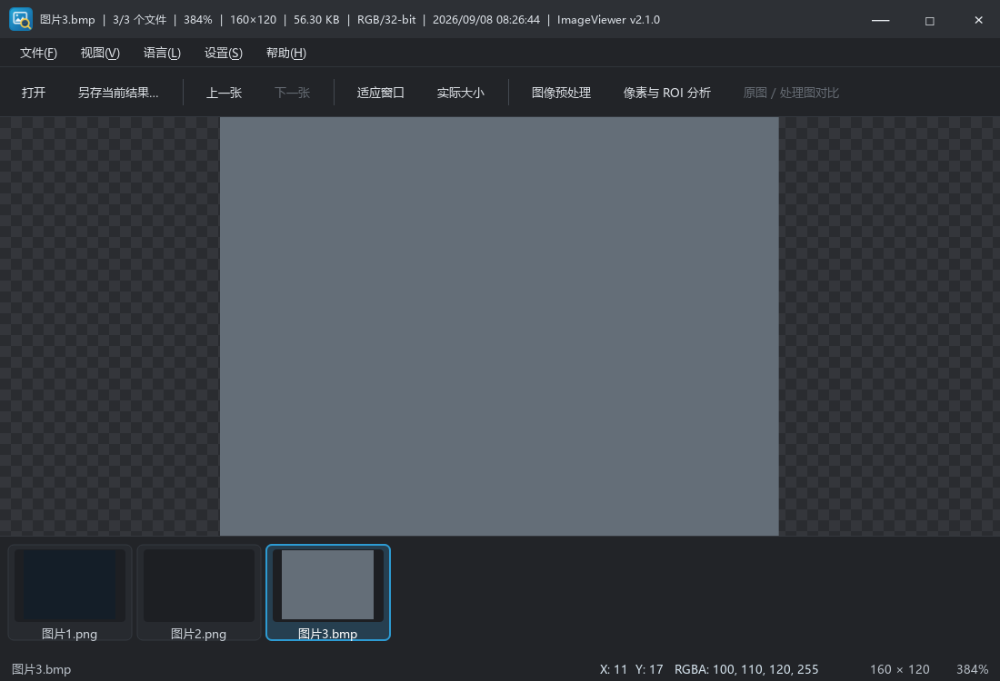
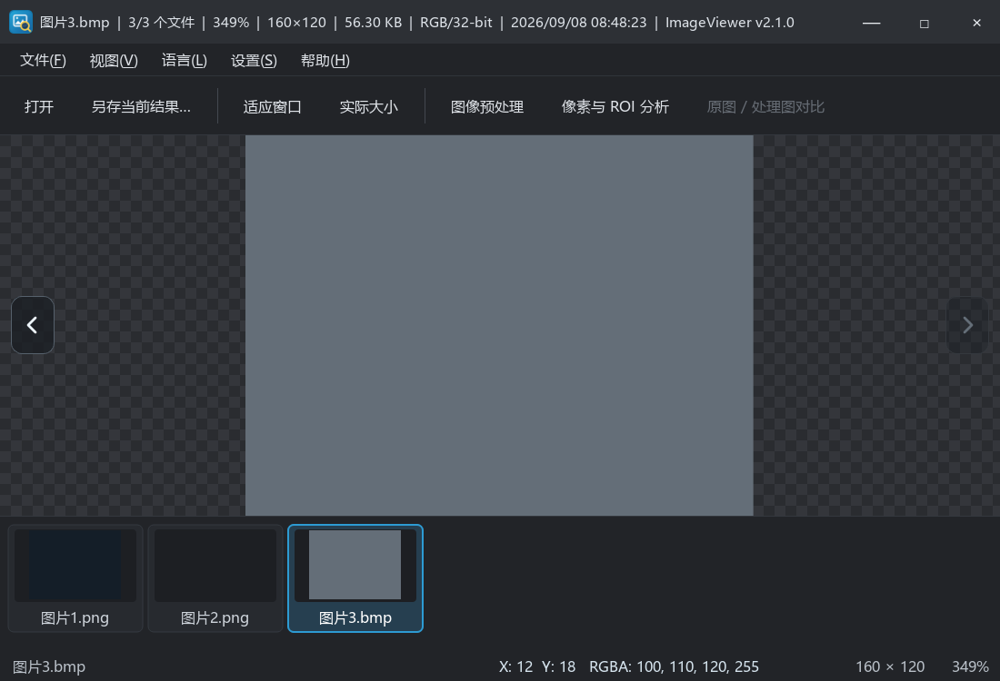

# 2026-09-08 字体、翻图导航与程序图标优化记录

## 实现结果

1. 全局界面字体从 13px 增至 16px，标题信息从 12px 增至 15px。菜单、工具栏、状态栏、缩略图文件名和两个操作面板同步生效；标题栏、工具栏、缩略图卡片增大留白。分析面板增加滚动容器，短窗口也能访问完整内容。状态栏先应用字体样式再计算预留宽度，避免 RGBA 末尾截断；空白页提示使用像素字号，避免系统 DPI 导致文字重叠。
2. 移除工具栏的“上一张 / 下一张”文字按钮，在图像视口左右两侧居中显示半透明圆角箭头。箭头固定于视口，缩放、平移和调整窗口尺寸时不随图像移动。保留左右方向键、悬停提示和无障碍名称；加载期间禁用，首尾按目录边界禁用相应方向，空图时隐藏。
3. 沿用现有蓝色图像/放大镜应用标识，导出 16、24、32、48、64、128、256px 七种尺寸的透明 ICO，通过 Windows RC 资源嵌入 EXE。VS2019 和 CMake 两套构建均接入；应用内图标与 EXE 使用同一绘制来源。

## 验证结果

- VS2019 Debug、Release 构建成功，各 29 项回归检查通过。
- TEST-28：实际点击箭头往返翻图、首尾禁用、空图隐藏，工具栏不再含翻图按钮。
- TEST-29：100% 原尺寸滚动以及改变窗口尺寸后，两侧箭头仍固定居中。
- CMake Release 构建成功，CTest 1/1 通过，包含上述 29 项检查。
- 读取三份 EXE（VS Debug、VS Release、CMake Release）的 `RT_GROUP_ICON` 与 `RT_ICON` 资源，均包含全部七种尺寸。
- 桌面实测 Release 的空白页、预处理和分析面板：中文显示、字号、控件留白与滚动区域正常。最终 Release 已重新启动。
- 翻译扫描共 133 条，未新增文案，保留现有中英文翻译。源码编码检查及 `git diff --check` 通过。
- 仍有既有 Qt 头文件 C4127、Release qtmain.pdb 缺失警告，不影响构建和运行。

本轮截图使用自动回归数据；offscreen 截图不裁切圆角，圆角状态继续由 TEST-27 验证。桌面跨屏 DPI、多显示器及资源管理器旧图标缓存刷新不在自动回归覆盖范围内。

## 外观对照

修改前：



修改后：



程序图标：


## 图标维护

常规构建直接使用已提交的 `resources/ImageViewer.ico`。仅在修改 `src/ui/AppIcon.h` 图标设计后重新生成：

```powershell
cmake -S . -B build -G "Visual Studio 16 2019" -A x64 -DCMAKE_PREFIX_PATH="$env:QTDIR"
cmake --build build --config Release --target ImageViewerIconGenerator
.\build\Release\ImageViewerIconGenerator.exe resources/ImageViewer.ico
.\scripts\build.ps1 -Cfg Release
```

运行库、测试数据、日志和 EXE 留在本地生成目录，不提交到 Git。Release 程序位于 `bin/Release/ImageViewer.exe`，分发时需包含同目录 DLL 和插件目录。
