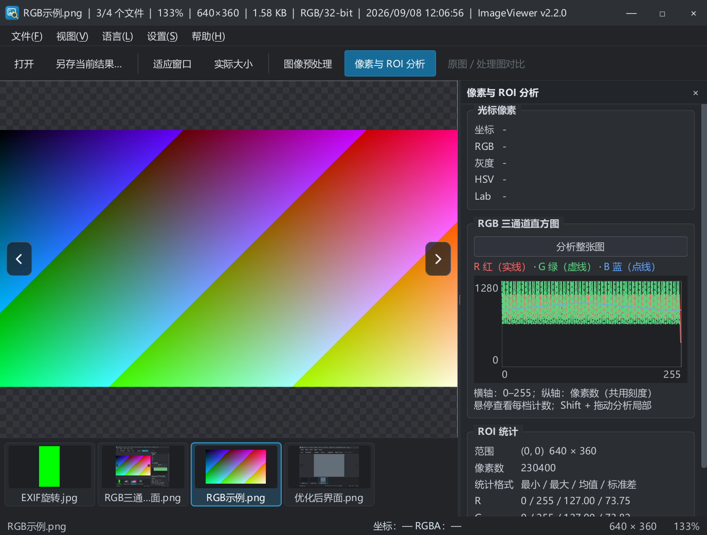

# 2026-09-08 深度体验与优化建议

本轮按使用者路径操作 Windows Release 桌面程序，并用 Debug/Release 自动回归补充边界、异步与像素准确性检查。版本仍为尚未发布的 2.2.0；未推送远端或发布 Release。

## 本轮已落地

1. 首张按左键、末张按右键不再平移图像；图像区左右键仅翻图。
2. 翻图快捷键只在图像及缩略图区生效。实际发现的“点击亮度滑块后按右键却切图”已修复，桌面复测亮度 10 → 11、图片不变。
3. 帮助 → 关于：应用图标、版本、作者 **Blazar**、邮箱 **blazarlin@gmail.com**、许可说明；文本可选，邮箱可点击，未在验收中发送邮件。
4. 状态栏按 R 红、G 绿、B 蓝显示通道数值，A 保持主题文字色。
5. 分析面板取消独立页签，按光标像素、直方图、ROI 统计纵向排列；窗口较矮时滚动查看。
6. 彩色直方图三通道叠加于同一绘图区，共用计数纵轴；R 实线、G 虚线、B 点线，悬停同时显示同一档的三个计数。灰度图保留单曲线。
7. 新增“分析整张图”，清除旧 ROI 选框后统计全图，沿用后台计算和旧任务作废机制。
8. 实测发现双滚动条交角露白，已纳入深色主题；新增分析按钮和关于窗口也统一深色。
9. 实测灰度像素 HSV 曾显示 −1°，现在显示“无色相”。
10. README、更新日志、英文翻译和最新交接入口同步；刷新便携包。

## 实际体验记录

| 功能与操作 | 观察结果 / 验证方式 |
| --- | --- |
| 中文路径打开 PNG | 用 Ctrl+O 和系统文件对话框打开 `obj/260908-翻图体验/1.png`，标题、尺寸、目录序号和缩略图同步 |
| 首尾翻图 | 首张原尺寸有横向滚动空间，左键后图像位置不变；右键切到第二张；末张放大到 376%，再按右键不移动。自动测试另覆盖两端连续按键 5 次 |
| 缩略图点击 | 点击彩色样图及界面截图，主图与当前项同步 |
| 适配、原尺寸、高倍率 | 原尺寸显示 100%；滚轮放大到 1681% 出现像素网格，拖动仍能平移，两侧箭头保持在视口边缘 |
| 实时取样 | 在图像中拖动后，状态栏坐标及 RGB 分色读数更新；移出后清空。自动检查已知像素 (12,18) 的数值 |
| 预处理开关与亮度 | 启用后调节亮度；处理完成有耗时反馈。最终构建已实测滑块右键 10 → 11，不翻图 |
| 灰度转换 | 选择“灰度”后彩色样图变为灰度，分析整图显示单条灰度直方图 |
| 对比 | Ctrl+D 开启分割对比，拖动分割线可改变位置；调整通道后对比会退出，记录为下方建议 |
| 保存结果 | 系统“另存当前结果”对话框保存至 `obj/260908-体验结果.png`，状态栏显示已保存；读取导出图的 (100,100)、(500,200)，RGB 均为原图加 10 并饱和截断，确认导出完整处理图而非对比截图 |
| 彩色整图分析 | 640×360 PNG 点击分析，像素数 230400，三色曲线共用纵轴，面板无 Tab |
| 灰度整图分析 | 处理后的灰度图点击分析，像素数 230400、单条曲线；原图缩略图保留彩色，便于区分输入与结果 |
| 右键目录 | 图像右键 → 打开图像所在文件夹，资源管理器实际打开 `bin/Tests/Release/ImageViewerCoreTestsData` |
| 关于 | 实际打开并核对作者、邮箱及版本；随后提高邮箱链接对比度并去掉无用途的问号按钮 |
| ROI、Esc、拖放、失败恢复 | 自动回归：ROI 计算、异步旧结果作废、Esc 清区、Qt 文件拖放事件、损坏文件保留原图及索引 |
| 预设、阈值、RGB 通道、缓存、EXIF、显示金字塔 | 本轮运行既有自动检查；不将其算作逐项桌面手动验收 |

范围说明：本轮没有覆盖每种滤波、边缘和形态学算子的桌面组合，也没有重新执行真实资源管理器跨窗口拖放、英文重启、多显示器、超大图压力和干净系统部署。相关自动检查不能替代这些场景的人工验收。

## 后续 10 条优化建议

以下为下一轮建议，尚未实施。P1 优先影响日常工作，P2 改善效率，P3 完善体验。每条都给出触发场景和验收方向，便于集中回复。

| 编号 | 优先级 | 场景 / 依据 | 建议与验收方向 |
| --- | --- | --- | --- |
| S01 | P1 | 实际对比中修改灰度通道会退出对比，需要再次 Ctrl+D | 保留用户的对比开关及分割比例；新结果未就绪时显示处理中，完成后恢复同位置对比 |
| S02 | P1 | 分析面板打开后只有空图框；目前已有整图按钮，但处理完成或换图仍需重算 | 增加“自动更新分析”开关，默认手动；开启后防抖，旧结果明确标为失效，不显示错图统计 |
| S03 | P1 | 看图同时开分析会隐藏处理面板，当前分析对象只能从画面推断 | 明示“原图 / 处理结果”分析来源；对比模式下光标取样与 ROI 来源都应可解释，保存名称也体现来源 |
| S04 | P1 | 现有单实例实现与 README 已说明第二实例参数不转发（代码审查，未在本轮桌面复测） | 文件关联打开第二张图时转发到现有窗口并激活；带空格、中文、多文件参数回归 |
| S05 | P2 | 亮度、对比度、Gamma 数值外观像输入框，实际上是标签 | 改为可键入数值的输入框，与滑块双向同步；支持单参数复原，避免为了精确值反复拖动 |
| S06 | P2 | 整图分析后，较矮窗口中 ROI 详细统计需要下滚 | 像素组、统计组支持折叠；记录展开状态，让直方图可按需求扩大，同时保留大字体 |
| S07 | P2 | 渐变样图三条分布叠加较密，颜色及线型虽能辨认，仍难读峰值细节 | 图例点击隐藏/显示通道，增加十字线、档位锁定及可选对数纵轴；悬停计数始终保留原始整数 |
| S08 | P2 | 标题栏信息很多，长文件名会和尺寸、时间、版本竞争空间 | 标题保留文件名与序号，详细元数据集中到可复制的信息面板；窄窗口仍能识别文件名尾部 |
| S09 | P2 | 缩略图一直占据底部高度，文件名较长时中间省略 | 增加缩略图显隐快捷键、大小档位、目录搜索/定位当前项；隐藏时方向键照常翻图 |
| S10 | P3 | 真实使用常需把 ROI 均值或直方图计数拿去记录，现在只能看屏幕 | 增加复制像素/ROI 统计及 CSV 导出，附带文件路径、分析来源、ROI 坐标、时间；不导出未完成结果 |

## 待集中回复

直接在本段填写即可，本轮不阻塞交付。

- Q11：下一轮优先顺序建议 S01、S03、S05，再做 S02、S04。你的排序：____。
- Q12：分析默认依据建议“当前处理结果”，增加显式原图切换；对比时是否需要原图/结果双份 ROI 数据：____。
- Q13：自动分析建议默认关闭，手动点击整图/选 ROI；是否希望换图后自动计算：____。
- Q14：开源发布之前仍需集中确定的事项见 [既有待回复事项](260907产品待回复事项.md)。作者与邮箱已按本轮明确指令落地；其余许可、发布、签名选项不在此重复询问。

## 回归与交付证据

- VS2019 Release：构建成功，37 项检查全部通过。
- VS2019 Debug：构建成功，`QT_SCALE_FACTOR=1.5` 下 37 项检查全部通过。
- CMake Release：构建成功，CTest 1/1 通过（运行同一组 37 项检查）。
- 英文翻译：141 条有效消息，0 条未完成；源文件编码检查和 `git diff --check` 完成。
- 构建仍有既有 Qt 头文件/qtmain.pdb 警告，无新增编译错误。
- 检查日志保留在忽略的 `obj/260908-*-build.log`、`obj/260908-*-tests.log`。
- 便携包：`dist/ImageViewer-2.2.0-windows-x64.zip` 与同名 `.sha256`。版本未发布，版本号沿用 2.2.0。

下图来自最终 Release 的 offscreen 回归窗口，展示统一分析面板及叠加曲线；真实桌面体验结果见上表。

