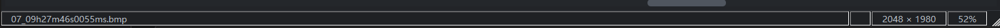

# 2026-09-08 界面交互优化记录

## 本轮需求与实现

1. 状态栏统一为深色背景，移除系统 `QStatusBar::item` 白色框线与标签边框，隐藏右下角突兀的尺寸抓手（窗口边缘仍可拖动调整大小）。实时显示零起点 X/Y 图像坐标及 RGBA 四通道值，范围 0–255。读数不依赖分析面板；空白区域/离开视图显示占位符。缩放、平移、切图、预处理和分割对比变化也刷新采样，长文件名可压缩并通过提示显示完整路径。
2. 主窗口使用 12 个逻辑像素的圆角轮廓裁切；缩放窗口时更新轮廓，最大化/全屏解除裁切，恢复普通状态时重新应用圆角。保留标题栏拖动与边缘缩放逻辑。
3. 主图右键菜单新增“打开图像所在文件夹”，通过系统默认文件管理器打开当前图片目录。无图和新图加载期间禁用；目录已移除或系统调用失败时在状态栏提示，不改变当前图片。

## 验证

- VS2019 Debug、Release 构建成功；两种配置的 27 项回归检查均通过。
- 新增 TEST-24 至 TEST-27：分析面板隐藏时像素值准确、离开视图清空旧值、菜单启用状态、圆角在最大化/还原后的状态。
- CMake Release 构建成功；CTest 1/1 通过（包含上述 27 项检查）。
- 英文翻译 133 条完成，0 条未完成；BOM 检查、git diff --check 通过。
- 桌面实测：启动 Debug、打开 EXIF JPEG、观察无白色框线状态栏，光标点击图像实测显示 X:22 / Y:57 / RGBA:0,255,1,255，右键打开菜单，点击后资源管理器确实打开图片所在的 ImageViewerCoreTestsData 目录。验证用资源管理器随后关闭。
- 自动截图通过 QWidget::grab 生成，用于核对状态栏布局；offscreen 平台不实际裁切截图角部，圆角状态由窗口区域回归检查覆盖。

## 外观对照

修改前（用户提供）：

修改后（回归测试界面截图）：

## 范围说明

RGBA 是当前显示图像的 8-bit 通道读数；16-bit 原始科学数据取样不在本次需求范围内。分割对比时悬停左侧读取原图，右侧读取处理图。文件夹菜单打开目录，不自动选中文件。
