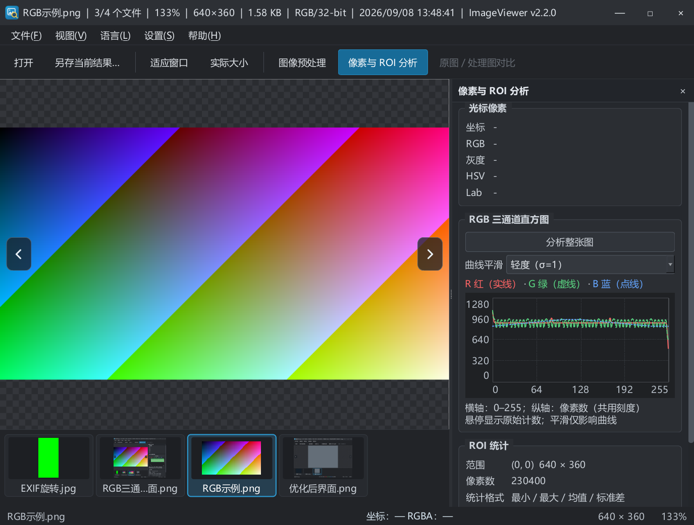

# 2026-09-08 直方图平滑验收

## 本轮调整

- 按截图中的曲线锯齿问题，增加高斯平滑：关闭（σ=0）、轻度（σ=1）、适中（σ=2）、较强（σ=4），系数单位为灰度档。
- 默认轻度，保存用户选择；切换强度只重建 256 档显示曲线，无需重新遍历整张图片。
- 原始 RGB/灰度直方图、ROI 像素数和通道统计均不修改；悬停显示原始整数计数。共用纵轴保留原始峰值尺度，调整平滑强度时不会跳变。
- 横轴增加 64 / 128 / 192；纵轴增加中间计数刻度和低对比度参考网格。图表较窄时隐藏中间横轴标签，避免拥挤。
- 边缘使用对称延拓，保持平坦分布和计数总量，避免 0/255 档被零填充压低。

## 验证

- Debug、Release 构建成功，各 39 项自动检查通过。
- 新增 TEST-38：关闭还原原值、平滑削弱尖峰、边缘总量守恒、平坦分布不变、空数据处理。
- 新增 TEST-39：四种强度下悬停原值不变、默认轻度、记住选择。
- CMake Release 构建成功，CTest 1/1 通过；英文有效翻译 147 条、0 未完成；编码及差异格式检查通过。
- 桌面验证：重新打开当前 BMP 图片，分析整图，切换平滑强度可即时更新，曲线与中间刻度显示正常。
- 当前图片与更新前 ROI 已记录在本机忽略目录 `obj/260908-smoothing-session.json`，不随源码或便携包提交。重启后重新框选 ROI 才能恢复同一区域分析。

没有需要阻塞实现的疑问。本轮将“平滑”解释为仅平滑直方图显示，统计仍以原始像素为准。下图是 Release 自动回归样图的轻度平滑效果。

