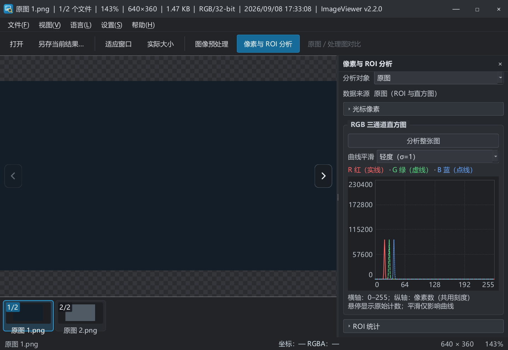

# v2.2.0 首版发布记录

## 本轮落实

- 删除缩略图搜索、定位和大小选择整行，固定小缩略图（图像 80×54，跟随系统 DPI）。
- 隐藏缩略图滚动条，保留鼠标滚轮浏览、左右键翻图和当前项自动定位。
- 每张缩略图左上角显示序号/总数，选中项使用蓝底突出当前位置。
- 同步中文 README、快捷键、英文翻译和首版变更记录。首版沿用现有版本号 v2.2.0。
- 公开包由 GitHub Windows 构建产生，Qt 5.15.2 / OpenCV 4.5.5；许可证收集覆盖 OpenCV 和 Qt 对应模块源码。

## 验证

VS2019 Debug、Release 各 50 项回归通过；Debug 150% 缩放通过；CMake Release CTest 1/1 通过。新增 TEST-50 覆盖隐藏滚动条后滚轮浏览与末项定位，TEST-45 更新为固定尺寸和序号验收。源文件编码和 diff 空白检查完成。新版也已在真实桌面打开合成彩色图，确认搜索行消失、当前项高亮、角标显示。

远端独立构建、发布包校验和启动检查已完成，结果见下节及 [Windows Actions](https://github.com/BlazarLin/ImageViewer/actions/workflows/windows.yml)、[v2.2.0 Release](https://github.com/BlazarLin/ImageViewer/releases/tag/v2.2.0)。完整代码审查见根目录 `260908_ImageViewer_发布前审查.md` 及同名 PDF。

## 正式发布结果

- 2026-09-08 17:59（北京时间）发布 v2.2.0，公开、非预发布版本。
- 发布标签对应提交 `c62963714ab5f092bf98131247135fd52a2ececb`；[独立构建与 Debug/Release 回归全部成功](https://github.com/BlazarLin/ImageViewer/actions/runs/34211702204)。首次运行暴露的 PowerShell 逗号参数及 OpenCV 4.5.5 highgui 配置问题已修正后重跑。
- 下载 [Windows x64 ZIP](https://github.com/BlazarLin/ImageViewer/releases/download/v2.2.0/ImageViewer-2.2.0-windows-x64.zip)，大小 20,151,220 字节；[SHA-256 文件](https://github.com/BlazarLin/ImageViewer/releases/download/v2.2.0/ImageViewer-2.2.0-windows-x64.zip.sha256) 同步发布。
- ZIP SHA-256：`88478bc84aa5923934a2b3c4c97185a493822f418f71e9d399f7529882cc2c63`。下载的 CI 外层归档与 GitHub artifact digest 相符，内层 ZIP 与校验文件一致，上传后的 Release asset digest 也一致。
- `build-info.json` 的 revision 与标签一致，工作树无修改，Qt 5.15.2、OpenCV 4.5.5。包内共 228 个条目，包含 Qt/OpenCV 许可来源材料。
- 从独立解压目录启动，PATH 仅保留 Windows 系统目录，清除 Qt/OpenCV 开发环境变量；BMP/JPEG/PNG/TIFF 均通过真实窗口打开、翻图及尺寸核对。进程所加载的 Qt、OpenCV、CRT 和图片插件均来自便携目录。
- 未登录 GitHub 的 API 请求已确认 latest 为 v2.2.0，公开资产可见，大小与 digest 正确。当前未签名、多显示器和全新虚拟机未完整验收的限制保持不变。
- 已从公开 Release 下载直链重新下载完整 ZIP，SHA-256 再次核对一致；本地网络较慢时使用断点续传，最终校验通过。

发布后的本记录只补充证据，不移动已发布标签或替换 ZIP。

## 产品约定与待后续统一回复

本轮发布和推送已获明确授权，按要求直接执行。之前 S09 的大小和搜索功能以本轮取消要求为准；保留历史回复原文。序号按每项在当前浏览列表中的位置从 1 开始，总数以当前目录或显式多文件列表为准。

没有新增需要阻塞本轮的问题。已有 P9 三项仍暂缓；签名、安装程序、自动更新、多显示器完整验收和高位深精度分析留在后续版本。首版是未签名的 Windows x64 便携 ZIP。

